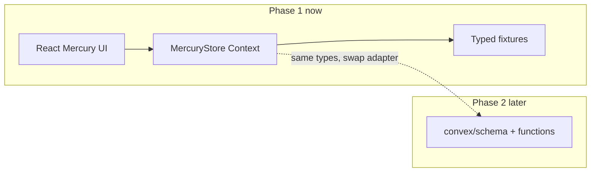

# Mercury frontend rebuild (no auth, no Convex)

## What changes

The repo today is a thin **Operator OS** shell ([`src/App.tsx`](src/App.tsx)) wired to Convex (`workstreams`, `threads`, `artifacts`). The PRDs define **Mercury**: a marketing operating system centered on **sources → briefs → campaigns → channel drafts → approvals → export packets → measurement**, with **role workspaces**, a **knowledge vault**, and a **graph** view of the pipeline.

This pass replaces the UI domain model and navigation to match the PRDs, runs entirely on **in-memory mock state**, and **disconnects** `ConvexProvider` / `useQuery` / `useMutation` while **keeping** [`convex/`](convex/) untouched for phase 2.



## PRD alignment (merged from both docs)

| PRD concept          | UI surface           | Mock entity                                      |
| -------------------- | -------------------- | ------------------------------------------------ |
| Source hub           | Sources              | `Source`, `SourceSnapshot`                       |
| Research briefs      | Briefs               | `Brief`                                          |
| Campaigns / strategy | Campaigns            | `Campaign`                                       |
| Channel draft studio | Studio               | `Draft` + `channel` enum                         |
| Approvals            | Approvals            | `ApprovalRequest`                                |
| Calendar / scheduler | Calendar             | `CalendarItem`                                   |
| Memory vault         | Vault                | `KnowledgeDoc`, `VoiceProfile`, `Skill`          |
| Graph model          | Graph                | `GraphNode`, `GraphEdge` (derived from entities) |
| Role workspaces      | Header role switcher | `RoleKey` filters queues                         |
| Codex / automations  | Automations (stub)   | static list + “open in Codex” copy               |
| PostHog / Dub        | Analytics (stub)     | static KPI cards                                 |
| Integrations         | Settings (stub)      | Mailchimp, Slack, Dub badges, no keys            |

**Explicitly out of scope now:** Convex Auth, `@convex.dev` gating, PostHog provider, Mailchimp/Dub API calls, Codex app-server bridge.

## Target information architecture

**Shell:** sidebar + top bar (role switcher, workspace label, primary actions).

**Primary nav** (replace current 7-item Operator nav):

1. **Command** — strategic home: active campaigns, draft queue, stale sources, upcoming calendar items
2. **Sources** — registry + freshness + link to briefs/drafts
3. **Briefs** — research brief list/detail, citations, confidence
4. **Campaigns** — objectives, audience, linked briefs/drafts
5. **Studio** — channel tabs: X, LinkedIn, Reddit, Discord, YouTube, Newsletter; variant versions; manual-post export packet preview
6. **Approvals** — review queue with approve/reject/request changes (local state)
7. **Calendar** — week/list of due dates and review reminders
8. **Vault** — canonical docs, voice profiles, skills (read-only + “edit in Codex” placeholder)
9. **Graph** — interactive pipeline graph (see below)
10. **Automations** — stub cards for daily research, newsletter heartbeat, analytics review
11. **Analytics** — stub funnel/KPI tiles aligned to PRD event names
12. **Settings** — integration placeholders only

Rename product copy everywhere from “Marketing Operator OS” → **Mercury** ([`index.html`](index.html), sidebar, docs).

## Graph view (long-term friendly, not overbuilt)

Use a **typed graph layer** in [`src/data/types.ts`](src/data/types.ts) (`GraphNode`, `GraphEdge`, `nodeKind`, `status`) and a **selector** that builds the graph from campaigns/briefs/drafts/approvals/sources.

**Renderer:** small custom interactive SVG (or canvas) component in [`src/components/graph/GraphCanvas.tsx`](src/components/graph/GraphCanvas.tsx):

- Pan/zoom optional later; v1: click node → side panel with entity detail
- Filter by campaign, channel, status
- Layout: left-to-right pipeline columns (sources → briefs → drafts → approvals → outcomes) so it stays readable without pulling in a heavy graph library

This keeps developer experience clean (graph is data-driven, renderer swappable) and matches the PRD “graph of transformations” without blocking on React Flow or similar.

## Frontend architecture

```
src/
  main.tsx                 # React only, no ConvexProvider
  app/
    AppShell.tsx           # layout, nav, role switch
    routes.tsx             # react-router routes (add dependency)
  data/
    types.ts               # mirrors future Convex schema from mercury-1.md
    fixtures.ts            # rich seed data (campaigns, briefs, drafts, sources…)
    mercury-store.tsx      # Context + reducer/hooks for CRUD
    graph.ts               # buildGraph(store) helper
  views/
    CommandView.tsx
    SourcesView.tsx
    BriefsView.tsx
    CampaignsView.tsx
    StudioView.tsx
    ApprovalsView.tsx
    CalendarView.tsx
    VaultView.tsx
    GraphView.tsx
    AutomationsView.tsx
    AnalyticsView.tsx
    SettingsView.tsx
  components/
    ui/                    # Panel, Metric, StatusBadge, EmptyState, Modal
    graph/GraphCanvas.tsx
    studio/ExportPacket.tsx
  styles/
    tokens.css             # extract from current styles.css
    app.css
```

**Dependencies:** add `react-router-dom` for deep-linkable sections (`/studio`, `/graph`, etc.). Keep `lucide-react`. Do **not** add Convex client usage in `src/` until phase 2.

**Adapter pattern for phase 2:** define a narrow `MercuryDataPort` interface (`listCampaigns`, `createDraft`, …) implemented by `MockMercuryData` now and `ConvexMercuryData` later so views do not rewrite.

## Convex folder (keep, disconnect)

- Leave [`convex/schema.ts`](convex/schema.ts), [`convex/operator.ts`](convex/operator.ts), `_generated` as-is.
- Remove runtime dependency: [`src/main.tsx`](src/main.tsx) drops `ConvexProvider`; [`src/App.tsx`](src/App.tsx) is deleted or becomes a thin re-export of `AppShell`.
- Update [`.env.example`](.env.example) with commented future vars (`VITE_CONVEX_URL`, PostHog) and a note that none are required for UI-only dev.
- `package.json` scripts can keep `convex:dev` for later; default `npm run dev` is Vite only.

## Workflow docs (per @workflow)

Before coding, add [`prds/mercury-ui-foundation.md`](prds/mercury-ui-foundation.md) with:

- Problem: current UI does not match Mercury PRDs and is blocked on Convex
- Solution: frontend-first mock workspace
- Files to touch, edge cases, verification (`npm run dev`, `npm run build`, `npm run lint`)
- Task completion log

After implementation, sync [`task.md`](task.md), [`changelog.md`](changelog.md) (use `git log --date=short -n 10` for dates), [`files.md`](files.md).

## Verification

- `npm run dev` — app loads with seed data, no Convex connection spinner
- `npm run build` + `npm run lint` — clean
- Role switcher filters Command/Studio queues
- Studio shows export packet (copy checklist, channel body, citations) for an approved draft
- Graph nodes click through to entity detail
- No `convex/react` imports under `src/`

## Phase 2 preview (not in this pass)

When you are ready: align [`convex/schema.ts`](convex/schema.ts) to mercury-1 tables (`campaigns`, `briefs`, `drafts`, `documents`, …), replace `operator.ts` workstream/thread naming, add auth + `@convex.dev` guard, implement `ConvexMercuryData` adapter.
